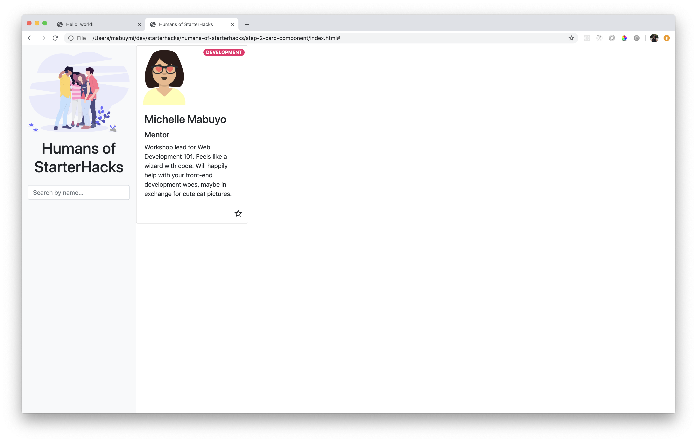

# Step 2: Card Component

## Goal



Create the HTML content for the Card component that displays a person's information such as: name, role, stream, description, image, and a favourited indicator.

## Steps

### Bootstrap Card Component

1.  Let's use the [Card component from Bootstrap](https://getbootstrap.com/docs/4.4/components/card/) to get started. Add this under the `main-content` div container.

    ```html
    <div class="card" style="width: 18rem;">
      
      <div class="card-body">
        <h5 class="card-title">Card title</h5>
        <p class="card-text">
          Some quick example text to build on the card title and make up the
          bulk of the card's content.
        </p>
        <a href="#" class="btn btn-primary">Go somewhere</a>
      </div>
    </div>
    ```

### Add relevant content

1.  Replace with relevant content. Card title should be a person's name. Card text should be a description about them. Use your own name and description for now.

1.  Add the person's role under their name. Feel free to play with the `h` heading tags for sizing.

    ```html
    <h3 class="card-title">Michelle Mabuyo</h3>
    <h5>Mentor</h5>
    ```

### Add an image with Avataaars

1.  Let's find an image! There are a few ways to do this:

    - Upload an actual image of yourself and store it in your folder.
    - Find a URL of an image of yourself on the internet.
    - Create an avatar and either upload it to your local folder or grab the URL for it.

    We're going to do the third one.

    Check out [https://getavataaars.com/](https://getavataaars.com/) and create an avatar that best represents you.

    Click on the Show `` button to get the HTML code and replace it in the Card component.

    Alternative, you can download as a png file and save to the `img` folder and link to that instead. This will load the image faster.

    ```html
    
    ```

### Add a badge

1.  Add the person's stream (Development, Design, Business) as a [Badge Bootstrap Component](https://getbootstrap.com/docs/4.4/components/badge/). Place it below the image, before the `card-body`.

    ```html
    
    <span class="badge">Development</span>
    <div class="card-body" ...></div>
    ```

1.  Set up CSS classes for each badge to have a different color.

    ```css
    .badge-development {
      background-color: #ec1b69;
      color: white;
    }

    .badge-design {
      background-color: #3b56a5;
      color: white;
    }

    .badge-business {
      background-color: #82c94b;
      color: white;
    }
    ```

1.  Add the appropriate CSS class to your badge in HTML.

    ```html
    <span class="badge badge-development">Development</span>
    ```

1.  Let's style the badge to be displayed on the top right of the card. Place the `img` and badge to be in a container div. Add `w-50` class to the `img` (Bootstrap's utility class for 50% width). Add `float-right` class to the badge (Bootstrap's utility class for floating the element to the right.).

    ```html
    <div>
      
      <span class="badge badge-development float-right">Development</span>
    </div>
    ```

1.  Add more styling to the badge with utility classes! Feel free to play around here. Add `badge-pill mt-2 mr-2 text-uppercase`.

    ```html
    <span
      class="badge badge-pill badge-development float-right mt-2 mr-2 text-uppercase"
    >
      Development
    </span>
    ```

### Add an icon button

1. Let's set up Material Icons as our icons font. The easiest way is to set up using [Google Web Fonts](http://google.github.io/material-design-icons/#icon-font-for-the-web). Add this line to the `<head>`, after the Bootstrap import and before your custom `styles.css` import.

   ```html
   <link
     href="https://fonts.googleapis.com/icon?family=Material+Icons"
     rel="stylesheet"
   />
   ```

1. In your Card component, replace the button text that says "Go somewhere" with a [Material Icons star icon](https://material.io/resources/icons/?search=star&icon=star_border&style=baseline).

   ```html
   <a href="#" class="btn btn-primary"
     ><i class="material-icons">
       star_border
     </i></a
   >
   ```

1. Replace the `a` element with a `button` (since it's not leading to a link elsewhere, the `href` attribute is unneeded). Replace the `btn-primary` class with `fave-btn`

   ```html
   <button class="btn fave-btn">
     <i class="material-icons">
       star_border
     </i>
   </button>
   ```

1. When hovered, the icon button should turn yellow. Let's do this with CSS.

   ```css
   .fave-btn:hover {
     color: #f1c91c;
   }
   ```

1. To fix the spacing issue caused by `card-body`, move the `button` outside of that `div` container and place it within its own `div`. Add a `text-right` class to the `div` container in order to align it to the right.

   Note that without the `div` container for the button, the entire row will be clickable because of the card's built-in flex layout! Try it without the `div` container for the button to test it out.

   ```html
   <div class="card-body">
     <h3 class="card-title">...</h3>
     <h5>...</h5>
     <p class="card-text">
       ...
     </p>
   </div>
   <div class="text-right">
     <button class="btn fave-btn">
       <i class="material-icons">
         star_border
       </i>
     </button>
   </div>
   ```
