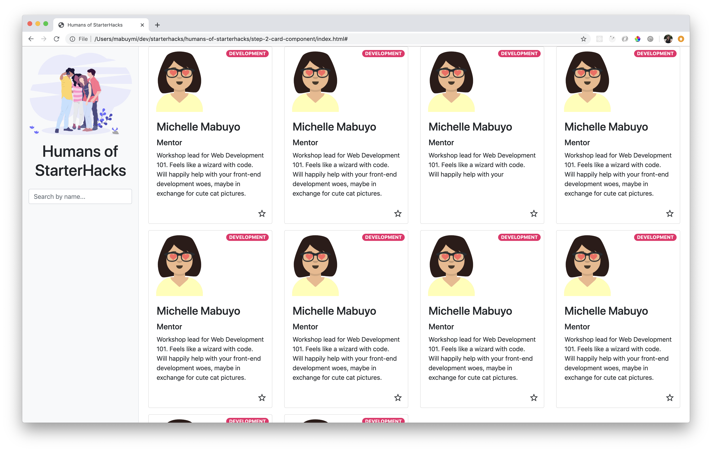

# Step 3: Multiple Cards Layout

## Goal



With the template for one card done, let's create more cards and style the layout.

## Steps

### Bootstrap Grid Cards Layout

Let's use the [Grid Cards layout from Bootstrap](https://getbootstrap.com/docs/4.4/components/card/#grid-cards).

1. Wrap the `div.card` component in a `div` container with class `row row-cols-1 row-cols-md-2 row-cols-lg-4`. This means we want 4 columns when the screen size is large, 2 when the screen size is medium, and 1 column when the screen size is small. Bootstrap takes care of these breakpoints.

   ```html
   <div class="row row-cols-1 row-cols-md-2 row-cols-lg-4">
     <div class="card" style="width: 18rem;">
       ...
     </div>
   </div>
   ```

1. Again, wrap the `div.card` component in a `div` container with class `col mb-3`. Remove the inline style for width 18rem. Add `h-100` to the card so that all cards have equal heights within a row, no matter the length of the content inside.

   ```html
   <div class="row row-cols-2 row-cols-lg-4">
     <div class="col mb-3">
       <div class="card h-100">
         ...
       </div>
     </div>
   </div>
   ```

1. Copy the code starting from `<div class="col mb-3">` down to the closing `div`. Paste it right after the closing `div`. Do this at least 4 times to check that the layout looks good! Then, undo the changes. We're going to generate this dynamically to avoid duplicate code next!
