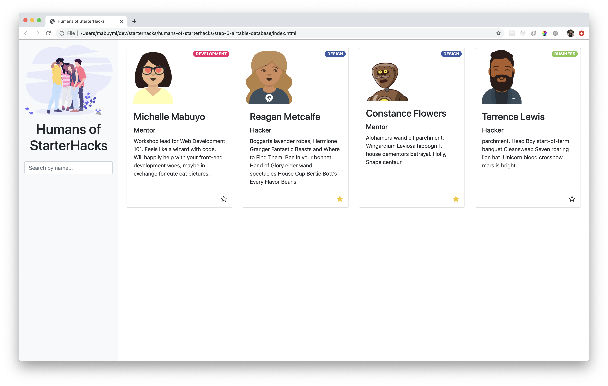
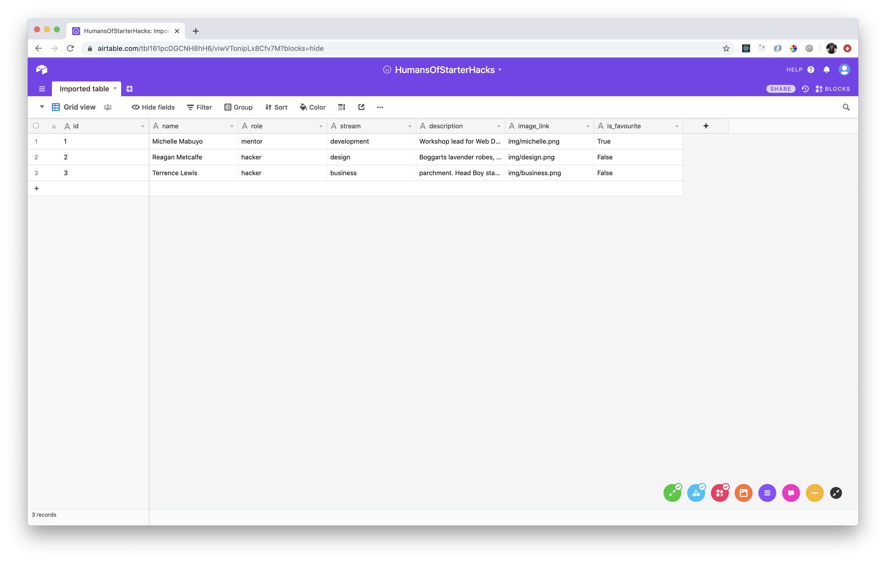

# Step 6: Airtable Database

## Goal



Use an Airtable as a database to get the data for the list of people. Update a person in the database when the fave button is clicked.

## Steps

We want to replace our hardcoded data with data obtained from a database. This also allows us to persist changes like toggling `is_favourite`, or adding a new person!

### Set up Airtable Base

Airtable is one of many ways to store your data. We're using Airtable for this project because it has an easy-to-understand interface (spreadsheet visualization) and hassle-free setup for API calls.

1. Go to the [Airtable website](https://airtable.com/) and sign up for an account.

1. Create your workspace, call it `StarterHacks`.

1. When you click "Add a base", there is an option to import from spreadsheet. Let's convert our data to a CSV file using a [JSON to CSV Converter](https://json-csv.com/). Copy the contents of your array in `peopleData` (without the brackets `[]`, just the stuff inside it). Paste it into the JSON to CSV Converter. Click on "Download CSV".

1. In Airtable, click on _"Add a base"_ and then _"Import from spreadsheet"_. Drag the CSV file into the box to import it.

1. You should have something that looks like this:



1. Rename your base and table to be called _HumansOfStarterHacks_. You can also change the base color and icon.

### Convert column types

Right now, all of the column's types are set to text. To change a role's field type, click on the arrow beside the column name, then click _Customize field type_.

1. Convert the `role` column and the `stream` column to be a _Single Select_ field type.

1. Convert the `is_favourite` column to be a _Checkbox_ field type to represent a boolean.

1. Convert the `id` column to be an _Autonumber_ field type so it takes care of ids for us.

### Add a row

1. Try adding another row inside Airtable! Leave the `img` column blank, we can set up an image placeholder later.

### Airtable API

Now that our data is set up, let's see how we can call it using the Airtable API.

1. Set up an API key for your account. Click on your profile picture on the top right, then click on Account.

1. In the second section under _API_, click on the button _"Generate API Key"_.

1. Click on the [Airtable API link](https://airtable.com/api) to access the API page. Click on _Humans of StarterHacks_ for the API docs specific to your base.

1. Check off "Show API key\* checkbox on the top right so that the sample code can be easily copy pasted.

1. Let's test the API! On the right, there is example code you can run on your Terminal. Try copy pasting the code under the _List HumansOfStarterHacks records_ section. The result should give you a list of records that were in your database.

### Using `fetch` to retrieve records

Time to link the database with our website using [fetch](https://developer.mozilla.org/en-US/docs/Web/API/Fetch_API/Using_Fetch).

We're going to recreate the `curl` code with `fetch`.

1. Create a function called `getData` and call it below.

   ```js
   const getData = () => {};

   getData();
   ```

1. Inside the function, get your _Airtable ID_ and _API Key_ from the Airtable API and set them to `url` and `key` variables.

   ```js
   const getData = () => {
     // replace {YOUR_AIRTABLE_ID} with your own.
     const url =
       "https://api.airtable.com/v0/{YOUR_AIRTABLE_ID}/HumansOfStarterHacks";

     const key = "{YOUR_API_KEY}";
   };
   ```

1. Set up the _Authorization_ header with the key. The header needs to be under an `options` object.

   ```js
   const options = {
     headers: {
       Authorization: `Bearer ${key}`
     }
   };
   ```

1. Set up the `fetch` call with the `url` and `options`

   ```js
   fetch(url, options)
     .then(result => result.json())
     .then(result => {
       console.log(result);
     });
   ```

   In your console, you should see the records from the database!

### Replacing mock data with database data

1. Now that we have access to the database, we can remove the mock data. Set `peopleData` to an empty array.

   ```js
   let peopleData = [];
   ```

1. In the `fetch` call, set the results to replace peopleData and then replace the HTML with the new data.

   ```js
   fetch(url, options)
     .then(result => result.json())
     .then(result => {
       // result is an object with { records: Array[] }
       // in the array, there is {id, fields: {}, createdTime}
       // fields is where all the person's information lives
       // id is the record's id in Airtable (not to be confused with the id we gave in the mock data)

       peopleData = result.records.map(p => {
         return {
           recordId: p.id, // we need to keep track of the Airtable record ID for future updates
           ...p.fields
         };
       });
       replaceHTMLCardTemplate();
     });
   ```

1. Remove the call to `replaceHTMLCardTemplate()` initially since we are doing it inside `getData` now.

### Placeholder images

Let's add placeholder image for people that don't have an `image_link` field.

1.  Use the `#if` Handlebars helper to handle this. You can find a URL for an actual placeholder. I'll use [Robohash avatars](https://robohash.org/) for placeholders.

    ```html
    {{#if image_link}}
    
    {{else}}
    
    {{/if}}
    ```

### Updating a person in the database

Let's update the `is_favourite` flag for that person in the database when it's toggled.

1. In the `toggleIsFavourite` function, we need to change the manual updates to the `peopleData` array to a database update call. As well, update the `id` variable to be more clear that we're looking for the `recordId`.

   ```js
   const toggleIsFavourite = recordId => {
     console.log("is_favourite button clicked for: " + recordId);

     let person = peopleData.find(p => p.recordId === recordId);

     updatePersonInDatabase(recordId, { is_favourite: !person.is_favourite }); // we'll write this later
   };
   ```

1. The `toggleIsFavourite` function now takes a recordId, so update the function call in `initializeFaveBtnClickListeners` in the click listener to reflect this.

   ```js
   btn.addEventListener("click", () => {
     const recordId = btn.dataset.rid; // pid becomes rid for the recordId. Remove the parseInt because it's a string now
     toggleIsFavourite(recordId);
   });
   ```

1. In the HTML template, replace the calls to `id` to be `recordId` and `pid` to be `rid`.

   ```html
   <button
     class="btn fave-btn fave-btn--solid"
     data-rid="{{recordId}}"
   ></button>
   ```

1. Write the `updatePersonInDatabase` function to make a call to the database. Check the Airtable API for updating a record.

   ```js
   const updatePersonInDatabase = (recordId, fields) => {
     // replace {YOUR_AIRTABLE_ID} with your own.
     const url = `https://api.airtable.com/v0/{YOUR_AIRTABLE_ID}/HumansOfStarterHacks/${recordId}`;

     // replace {YOUR_API_KEY}
     const key = "{YOUR_API_KEY}";
     const body = { fields: fields };

     const options = {
       method: "PATCH",
       headers: {
         Authorization: `Bearer ${key}`,
         "Content-Type": "application/json"
       },
       body: JSON.stringify(body)
     };

     fetch(url, options)
       .then(result => result.json())
       .then(result => {
         peopleData = peopleData.map(p =>
           p.recordId === result.id
             ? { recordId: result.id, ...result.fields }
             : p
         );
         replaceHTMLCardTemplate();
       });
   };
   ```
