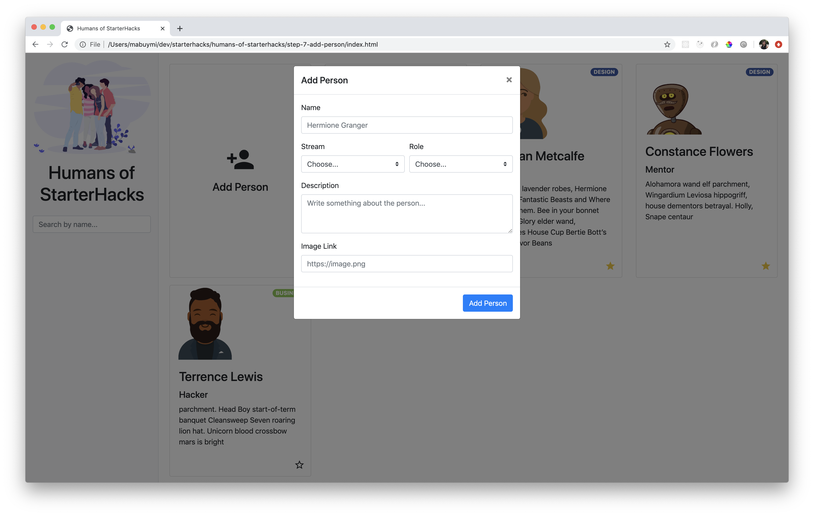

# Step 7: Add Person

## Goal



Add a person through a form on the website and save them to the database. The form will be contained in a modal.

## Steps

### Add Person Button

1. Add another card before all the people cards. This will act as the button to trigger our form modal.

   ```html
   <script id="card-template" type="text/x-handlebars-template">
     <div class="row row-cols-sm-2 row-cols-md-3 row-cols-lg-4">
       <div class="col mb-3">
         <div class="card h-100 justify-content-center">
           <button class="btn add-person-btn">
             <i class="material-icons" style="font-size: 4em">person_add</i>
             <h4 class="mt-2">Add Person</h4>
           </button>
         </div>
       </div>
       {{#each people}}
       ...
       </div>
   </script>
   ```

### Opening a Modal

1. Use [Bootstrap's Modal component](https://getbootstrap.com/docs/4.4/components/modal/#live-demo) to hold the form.

1. Add the `data-toggle` and `data-target` attributes to the button.

   ```html
   <button
     class="btn add-person-btn"
     data-toggle="modal"
     data-target="#add-person-modal"
   >
     ...
   </button>
   ```

1. Copy the example modal in the Bootstrap docs after the end of the `main-content` div container.

   Change the id to be `add-person-modal` to match the `data-target` attribute of the button above.

   Change the title to be "Add Person".

   Remove the Close button.

   Change the "Save changes" text to be "Add Person"

   ```html
   <!-- Modal -->
   <div
     class="modal fade"
     id="add-person-modal"
     tabindex="-1"
     role="dialog"
     aria-labelledby="addPersonModalLabel"
     aria-hidden="true"
   >
     <div class="modal-dialog" role="document">
       <div class="modal-content">
         <div class="modal-header">
           <h5 class="modal-title" id="addPersonModalLabel">Add Person</h5>
           <button
             type="button"
             class="close"
             data-dismiss="modal"
             aria-label="Close"
           >
             <span aria-hidden="true">&times;</span>
           </button>
         </div>
         <div class="modal-body">
           ...
         </div>
         <div class="modal-footer">
           <button type="button" class="btn btn-primary">Add Person</button>
         </div>
       </div>
     </div>
   </div>
   ```

### Building the Form

We'll use [Bootstrap's Forms component with validation built-in](https://getbootstrap.com/docs/4.4/components/forms/#validation).

1. Declare the `<form>` with validation classes.

   ```html
   <form class="needs-validation" novalidate></form>
   ```

1. Add a row for the name field. It'll take up the whole row (`.col`). The `input` element needs a `name` attribute that we'll use for the form submission later. The `id` attribute must match the `<label>` `for` attribute. Add a `required` attribute so that the form validation checks for a value in this field.

   ```html
   <div class="form-row">
     <div class="col mb-3">
       <label for="name">Name</label>
       <input
         type="text"
         name="name"
         id="name"
         class="form-control"
         placeholder="Hermione Granger"
         required
       />
     </div>
   </div>
   ```

1. Add a row for Stream and Role. These will be `select` fields. Each field will take up 50% of the row when there's enough screen space (`.col-md-6`). Similar to above, give the `select` element a `name` attribute. It also needs to be `required`.

   The first `<option>` will be a placeholder option, so add a `disabled` attribute to it and the text "Choose..."

   ```html
   <div class="form-row">
     <div class="col-md-6 mb-3">
       <label for="stream">Stream</label>
       <select name="stream" class="custom-select" id="stream" required>
         <option selected disabled value="">Choose...</option>
         <option value="development">Development</option>
         <option value="design">Design</option>
         <option value="business">Business</option>
         <option value="none">None</option>
       </select>
     </div>

     <div class="col-md-6 mb-3">
       <label for="role">Role</label>
       <select class="custom-select" id="role" required name="role">
         <option selected disabled value="">Choose...</option>
         <option value="hacker">Hacker</option>
         <option value="mentor">Mentor</option>
         <option value="volunteer">Volunteer</option>
         <option value="sponsor">Sponsor</option>
         <option value="organizer">Organizer</option>
       </select>
     </div>
   </div>
   ```

1. Add a row for the Description. This will be a `textarea` field. Similar to above, it needs `name` and `required` attributes.

   ```html
   <div class="form-row">
     <div class="col mb-3">
       <label for="description">Description</label>
       <textarea
         name="description"
         id="description"
         class="form-control"
         rows="3"
         placeholder="Write something about the person..."
         required
       ></textarea>
     </div>
   </div>
   ```

1. Add a row for the image link. It needs a `name` attribute, but it's not required.

   ```html
   <div class="form-row">
     <div class="col mb-3">
       <label for="image_link">Image Link</label>
       <input
         type="text"
         name="image_link"
         id="image_link"
         class="form-control"
         placeholder="https://image.png"
         required
       />
     </div>
   </div>
   ```

### Submitting the Form

1.  Add an `id` to the _Add Person_ button so we can add a click listener to it that handles the form submission.

    ```html
    <div class="modal-footer">
      <button type="button" class="btn btn-primary" id="add-person-submit-btn">
        Add Person
      </button>
    </div>
    ```

1.  Add an id to the `form` so we can access its contents in Javascript.

    ```html
    <form class="needs-validation" novalidate id="add-person-form"></form>
    ```

1.  In the `index.js` file, add a click listener to the submit button.

    ```js
    document
      .getElementById("add-person-submit-btn")
      .addEventListener("click", () => {});
    ```

1.  Inside the click listener, check for the form's validity (i.e. all fields have been filled out).

    ```js
    const form = document.getElementById("add-person-form");
    const isValid = form.checkValidity();
    ```

1.  If the form is not valid, Bootstrap needs to add the styles to indicate this, by adding the class `was-validated` to the form.

    ```js
    const form = document.getElementById("add-person-form");
    const isValid = form.checkValidity();

    if (!isValid) {
      form.classList.add("was-validated");
    }
    ```

1.  If the form is valid, we need to add that person to the database! First, get all of the values from the form using `FormData`

    ```js
    if () {...}
    else {
      const formData = new FormData(form);
      let person = {};
      for (var [key, value] of formData.entries()) {
        person[key] = value;
      }

      addPersonToDatabase(person); // we will code this later
    }
    ```

1.  Once the person has been added to the database, we need to [hide the modal](https://getbootstrap.com/docs/4.4/components/modal/#modalhide) and reset the form along with its validation.

    ```js
    $("#add-person-modal").modal("hide");
    form.reset();
    form.classList.remove("was-validated");
    ```

1.  Set up the `addPersonToDatabase` function with a test console.log call.

    ```js
    const addPersonToDatabase = person => {
      console.log(person);
    };
    ```

1.  Test the form!

    - First four fields are required. Clicking on the "Add Person" button without those fields filled in should result in an error.
    - Successfully see the person's information in the console when all required fields are filled in and the "Add Person" button is clicked. The modal should also close.
    - Opening the modal again after a successful submission will show cleared out fields to start again.

### Adding to Airtable Database

To [add a record to the database](https://airtable.com/appbCjCrgXZtlpR5L/api/docs#curl/table:humansofstarterhacks:create), make a POST call to the appropriate URL with the person's information.

1. In the `addPersonToDatabase` function, use the same pattern for `fetch` calls as we did in `getData` and `updatePersonInDatabase`.

   ```js
   const addPersonToDatabase = person => {
     const url =
       "https://api.airtable.com/v0/{YOUR_AIRTABLE_ID}/HumansOfStarterHacks";

     const key = "{YOUR_API_KEY}";

     const body = { fields: person };

     const options = {
       headers: {
         Authorization: `Bearer ${key}`,
         "Content-Type": "application/json"
       },
       method: "POST",
       body: JSON.stringify(body)
     };

     fetch(url, options)
       .then(result => result.json())
       .then(result => {
         console.log(result);
       });
   };
   ```

1. Add the person to the `peopleData` and update the HTML.

   ```js
   fetch(url, options)
     .then(result => result.json())
     .then(result => {
       const newPerson = { recordId: result.id, ...result.fields };
       peopleData.push(newPerson);
       replaceHTMLCardTemplate();
     });
   ```
